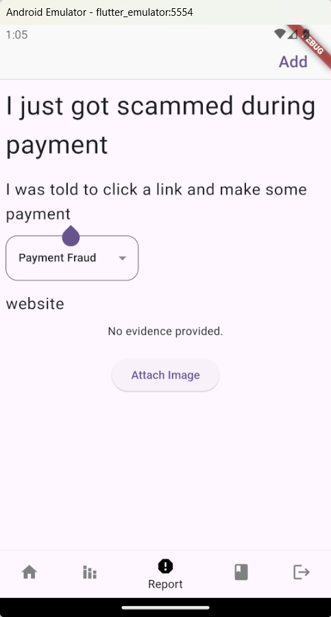

# BlocScam

An application to help you get the latest information about scams and educate you to not get scammed.

## Problem Statement

The escalating threat of financial frauds poses a significant challenge to the financial well-being of
individuals and businesses. Current anti-scam strategies are faced with gaps in public
awareness, legal limitations and ever evolving scam tactics employed by fraudsters. Implement
a comprehensive solution to combat bank scams that effectively addresses the above challenges.

## How does your hack answer the problem statement?

Our main idea is community-based solution. So, we want to create a forum that let user share their recent
experience about scam situation. Using this solution, the other user can be notified about the recent scam
methods/ways. Therefore, it will helps the user to realise if they are on the same situation and prevent them
from getting scammed. We alse has other features like analytics that shows the analytics of monthly report scams
we received from the user and the education that helps to educate the user to know about scam.

## How did you build your hack?

First, we read about the problem statement and came to conclusion that most of people that get scammed doesn't know
about the recent scam methods. So, we decided to make an application that ables to let the user knows about the recent scam
methods. However, we realise that it hards to collect data by ourselves. Therefore, we approach a community-based solution to
tackle this constraint. We build our application using flutter which has a lot of library that we could use to implement the
features we want to create. We use Firebase as our database server/provider to store the report we received from the user.

### How to use the application?
You can go to Add Report page and report your recent experience about scams. You can view your report on the home page.
